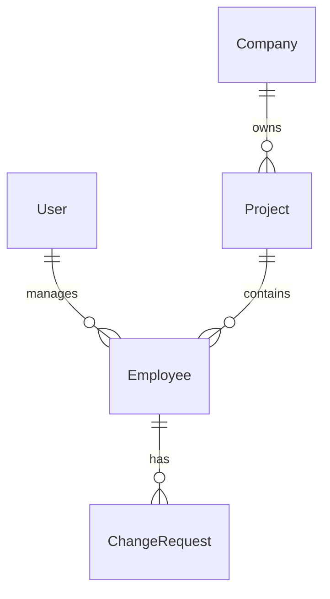

# 后端系统说明文档

## 一、系统架构
- 开发语言：Python
- Web框架：Flask
- 数据库：MySQL
- ORM：SQLAlchemy
- API风格：RESTful

## 二、目录结构
- 需求文档.md
- API.md
- backend/
  - app.py: Flask应用的入口文件，包含应用的创建和配置。
  - config.py: 配置文件，包含数据库URI、密钥等配置信息。
  - extensions.py: 扩展文件，初始化Flask扩展（如SQLAlchemy、Flask-RESTful、JWT等）。
  - init_db.py: 初始化数据库的脚本，包含创建数据库和初始化数据的逻辑。
  - modules/
    - auth/
      - __init__.py: 初始化文件，导入所有认证相关的模块。
      - models.py: 用户模型，定义了用户的表结构。
      - resources.py: 认证资源，包含登录、注册和登出功能。
      - schemas.py: 用户模式，定义了用户的序列化和反序列化规则。
      - routes.py: 认证相关的路由配置。
    - company/
      - __init__.py: 初始化文件，导入所有公司相关的模块。
      - models.py: 公司模型，定义了公司的表结构。
      - resources.py: 公司资源，包含获取公司列表、获取公司项目列表等功能。
      - schemas.py: 公司模式，定义了公司的序列化和反序列化规则。
      - routes.py: 公司相关的路由配置。
    - employee/
      - __init__.py: 初始化文件，导入所有员工相关的模块。
      - models.py: 员工模型，定义了员工的表结构。
      - resources.py: 员工资源，包含获取在岗员工列表、添加新员工等功能。
      - schemas.py: 员工模式，定义了员工的序列化和反序列化规则。
      - routes.py: 员工相关的路由配置。
    - change/
      - __init__.py: 初始化文件，导入所有变动相关的模块。
      - models.py: 变动请求模型，定义了员工调岗、离职等变动请求的表结构。
      - resources.py: 变动资源，包含获取待确认变动、批准变动、拒绝变动等功能。
      - schemas.py: 变动模式，定义了变动请求的序列化和反序列化规则。
      - routes.py: 变动相关的路由配置。
  - routes.py: 初始化所有模块的路由配置。
  - tests/
    - test_api.py: API测试文件，包含对各个API的测试用例。
  - data/
    - initial_data.json: 初始化数据文件，包含公司和项目的初始数据。
- README.md

## 三、功能模块说明

### 1. 用户认证模块
- **功能**：账号的注册、登录和登出
- **相关文件**：
  - 数据模型：`models/user.py`
  - API视图：`resources/auth.py`
  - 序列化：未使用，直接用 `{'token': token, 'user': {'id': user.id,'username': user.username}`
- **API路径**：
  - POST `/api/auth/login`
  - POST `/api/auth/register`
  - POST `/api/auth/logout`

### 2. 员工管理模块
- **功能**：显示员工名单，添加新员工。
- **相关文件**：
  - 数据模型：`models/employee.py`
  - API视图：`resources/employees.py`
  - 序列化：`schemas/employee_schema.py`
- **API路径**：
  - GET `/api/active-employees`(查询)
  - POST `/api/employees`(新增)

### 3. 变动管理模块
- **功能**：处理员工调岗、离职等变动申请
- **相关文件**：
  - 数据模型：`models/change_request.py`
  - API视图：`resources/changes.py`
  - 序列化：`schemas/change_schema.py`
- **API路径**：
  - PUT `/api/pending-changes/{id}/transfer`(申请调岗)
  - PUT `/api/pending-changes/{id}/resign`(申请离职)
  - GET `/api/pending-changes`(查询待处理)
  - PUT `/api/pending-changes/{id}/approve` (批准)
  - PUT `/api/pending-changes/{id}/reject` (拒绝)

### 4. 公司和项目管理模块
- **功能**：管理公司和项目信息
- **相关文件**：
  - 数据模型：
    - `models/company.py`
    - `models/project.py`
  - API视图：`resources/companies.py`
  - 序列化：
    - `schemas/company_schema.py`
    - `schemas/project_schema.py`
- **API路径**：
  - GET `/api/companies`
  - GET `/api/projects`

## 四、数据模型关系

